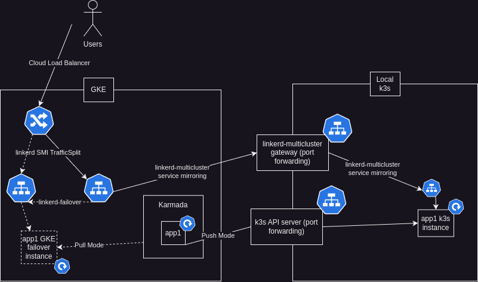

# gke-k3s-karmada-hybrid

This repo allows for the implementation of the below archiecture to automate cloud failover for a local k3s cluster to a GKE cluster (on separate networks). This setup provides improves the availability of my personal site while stil taking advantage of the reduced computing costs of using local resources.

It uses Karmada for multicluster orchestration. It uses linkerd-multicluster, linkerd-smi, and linkerd-failover for multicluster ingress with failover traffic splitting. Karmada manages deployments across both clusters, and linkerd-multicluster mirrors the services from the k3s cluster to GKE, where a TrafficSplit resource marked for failover divides the traffic and auto-adjusts weights based on the availability of the application in each cluster.

For information about the development of this architecture and its challenges, check out progressLog.md.

## Setup

This repository includes setup steps that can be followed with some care to achieve the same architecture. Here is a high-level step-by-step guide (Note that the k3s cluster is referred to as "desktop", since I used a testing cluster on my desktop during testing and development):

1. Configure a k3s cluster by referring to the k3s documentation. Configure the cluster to set --tls-san to the address used to access the cluster's API server from outside (e.g., a router's WAN address).
2. Configure a GKE cluster using the manifests in /terraform.
3. Install linkerd and linkerd-multicluster in both clusters using the steps in /linkerd/configureLinkerd.sh
4. Install linkerd-smi and linkerd-failover in the ingress cluster (GKE) using /linkerd/configureLinkerdFailover.sh
5. Expose the k3s cluster's API server port (6443) and the linkerd-gateway ports (4143 and 4191), e.g. by port-forwarding. (Configure the firewall using configureUfw.sh.template as a starting point)
6. Link the k3s cluster to GKE using the step in /linkerd/configureLinkerd.sh
7. Install karmada to GKE using the Helm chart in /helm/karmada.
8. Join the GKE cluster to Karmada in Pull mode following the steps in /karmada/configureKarmada.sh
9. Join the k3s cluster to Karmada in Push mode following the steps in /karmada/configureKarmada.sh
10. Install the (linkerd proxy sidecar-injected) ingress-nginx to GKE using the helm chart in /helm/ingress-nginx.
11. Now you can apply deployments to Karmada's API server. By applying PropagationPolicy, you can propagate them to your GKE and k3s clusters. By marking services for linkerd mirroring, you can cause k3s services to appear in GKE. By defining TrafficSplits for your GKE-desktop service pairs with failover annotations, you can use them as the backend for ingress to achieve multicluster failover.

## Deploying applications to this setup
I included an example Helm chart in /helm/example that shows a default Helm chart with changes applied to faciliate this failover setup. These include:

- Marking services for mirroring by linkerd in templates/service.yaml
- Including a propagationPolicy.yaml to propagate the chart's resources. I recommend using 'helm template' to check all resource types that will need propagation.
- Annotating ingress with ssl-passthrough=false and service-upstream=true

In addition, the ingress cluster will need to have a TrafficSplit resource applied to it with a controlled-by label and primary-service annotation to enable failover service routing. See karmada-test-case/trafficsplit.yaml for an example.

## A note on ingress
Because I use ArgoCD, I needed to enable SSL passthrough in helm/ingress-nginx. This means that any app that doesn't serve HTTPS traffic without a proxy will need the ssl-passthrough=false annotation. In addition, this helm chart has the necessary changes for linkerd sidecar injection. It also uses an externalTrafficPolicy=local, along with configuration options set (enable-real-ip=true and forwarded-for-header=proxy-protocol) to enable source IP preservation, to allow for IP whitelisting.

